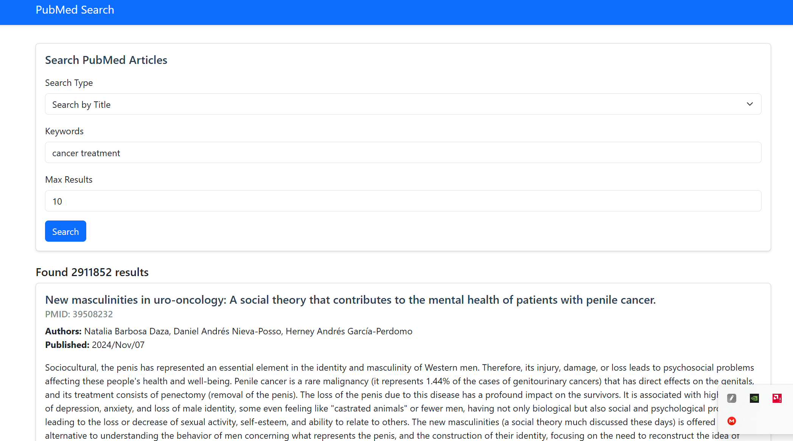

# PubMed Search Application 🔍

A modern web application built with FastAPI that provides an intuitive interface to search PubMed articles. The application includes both a user-friendly web interface and REST API endpoints for programmatic access.

## 📱 Interface Preview



Our intuitive web interface features:
- 🎯 Clean, minimalist search form
- 📝 Multiple search types (Title/Abstract/Date)
- 🔢 Configurable results limit
- 📊 Comprehensive result display including:
  - Article titles and authors
  - Publication dates
  - PubMed IDs (PMID)
  - Full abstracts (when available)
- 🎨 Bootstrap-based responsive design

## ✨ Key Features

### Search Capabilities
- 📚 **Title Search**: Find articles using keywords in titles
- 📝 **Abstract Search**: Search through article abstracts
- 📅 **Date-based Search**: Filter articles by publication date range

### Interface Options
- 🌐 **Web Interface**: Clean, responsive Bootstrap-based UI
- 🔌 **API Endpoints**: RESTful API with Swagger documentation

## 🛠️ Technology Stack

- **Backend Framework**: FastAPI
- **Template Engine**: Jinja2
- **Frontend Framework**: Bootstrap 5
- **Testing Framework**: pytest
- **Documentation**: Swagger/OpenAPI

## 🚀 Getting Started

### Prerequisites
- Python 3.8 or higher
- pip (Python package manager)

### Installation Steps

1. **Clone the Repository**
```bash
git clone https://github.com/your-username/pubmed-search-app.git
cd pubmed-search-app
```

2. **Set Up Virtual Environment**
```bash
# Windows
python -m venv venv
.\venv\Scripts\activate

# macOS/Linux
python -m venv venv
source venv/bin/activate
```

3. **Install Dependencies**
```bash
pip install -r requirements.txt
```

4. **Launch Application**
```bash
uvicorn main:app --reload
```

5. **Access Application**
- Web Interface: http://127.0.0.1:8000
- API Documentation: http://127.0.0.1:8000/docs

## 📁 Project Structure

```
pubmed_webapp/
├── tests/                  # Test files
│   ├── __init__.py
│   ├── test_api.py        # API endpoint tests
│   └── test_pubmed_client.py  # PubMed client tests
├── static/
│   └── style.css          # Custom styles
├── templates/
│   ├── base.html          # Base template
│   └── index.html         # Main search interface
├── main.py                # FastAPI application
├── pubmed_client.py       # PubMed API client
└── requirements.txt       # Project dependencies
```

## 🔍 API Endpoints

### Title Search
```http
GET /api/search/title?keywords=cancer&max_results=5
```

### Abstract Search
```http
GET /api/search/abstract?keywords=covid&max_results=5
```

### Date Search
```http
GET /api/search/date?start_date=2024/01/01&end_date=2024/03/01&max_results=5
```

## 🧪 Testing

```bash
# Install test dependencies
pip install pytest pytest-asyncio httpx

# Run all tests
pytest -v tests/

# Run specific test file
pytest tests/test_api.py
```

## 📈 Future Enhancements

### 1. Scalability Improvements
- [ ] **Caching System**
  ```mermaid
  graph LR
    Client --> LoadBalancer
    LoadBalancer --> Server1
    LoadBalancer --> Server2
    Server1 --> Redis
    Server2 --> Redis
    Redis --> PubMedAPI
  ```
  - Redis for response caching
  - Distributed caching
  - Cache invalidation strategies

- [ ] **Load Balancing**
  - Nginx configuration
  - Multiple server instances
  - Health monitoring

- [ ] **Container Orchestration**
  ```yaml
  version: '3.8'
  services:
    app:
      build: .
      replicas: 3
    redis:
      image: redis:alpine
    nginx:
      image: nginx:alpine
  ```

### 2. Performance Optimizations
- [ ] **Rate Limiting**
  - Request throttling
  - Usage quotas
  - Fair use policies

- [ ] **Parallel Processing**
  - Async operations
  - Batch processing
  - Worker pools

### 3. Monitoring System
- [ ] **Metrics Collection**
  - Performance monitoring
  - Usage statistics
  - Error tracking

### 4. Additional Features
- [ ] Advanced search filters
- [ ] Export functionality
- [ ] User authentication
- [ ] Search history
- [ ] Result sorting

## 🚀 Planned Architecture

```
                                    ┌─── FastAPI Server 1 ───┐
Client -> Nginx Load Balancer ─────├─── FastAPI Server 2 ───├─── Redis Cache ─── PubMed API
                                    └─── FastAPI Server 3 ───┘
                                              │
                                              │
                                     PostgreSQL Database
```

## 🔒 Security Features
- Input validation
- Rate limiting
- Error handling
- Request sanitization

## 📝 API Usage Example
```python
import requests

# Search by title
response = requests.get(
    "http://127.0.0.1:8000/api/search/title",
    params={
        "keywords": "cancer treatment",
        "max_results": 5
    }
)
articles = response.json()
```

## 🐛 Known Limitations
- Maximum 100 results per query
- Specific date format requirement (YYYY/MM/DD)
- Rate limits on PubMed API

## 📄 License

This project is licensed under the MIT License - see the [LICENSE](LICENSE) file for details.

